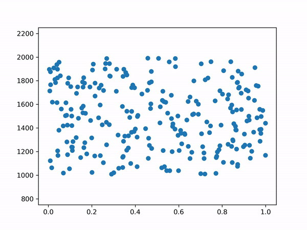

# RankingELO  

Simple implementation of ELO Ranking Computation. [Writeup can be found here.](https://t.co/wt9T8Cds3u?amp=1)  

There is also a Python implementation on another repository with a simulated rounds.  

By creating randomly distributed pairs of (skill level, ranking) and making players "fight" the results seem to converge towards what we expected (x-axis is skill level between 0 and 1, while y-axis is ranking).  

  

